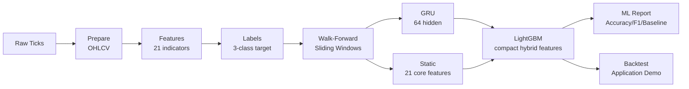
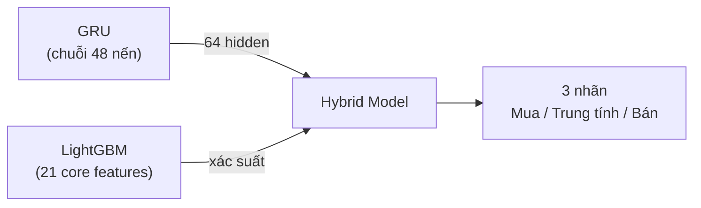

# Hybrid GRU + LightGBM

## Evaluating Short-Term Direction Prediction for XAU/USD Time Series

[](https://www.python.org/)
[](https://pixi.sh/)
[](https://lightgbm.readthedocs.io/)
[](https://pytorch.org/)

> This thesis builds and evaluates a Machine Learning pipeline for predicting
> short-term direction of XAU/USD using a Hybrid GRU + LightGBM model. The focus
> is on data quality, time-leakage prevention, walk-forward training, model
> comparison, and **classification evaluation** (Directional Accuracy, Macro F1,
> Confusion Matrix). The backtest section is an **application demo** that
> illustrates how signals *could* be used — it is **not** primary evidence of
> profitability.

**Primary output:** model evaluation metrics (accuracy, F1, per-class
precision/recall, confusion matrix) compared against baselines.
**Secondary output:** a lightweight backtest demo showing how predicted signals
translate into hypothetical trades.

XAU/USD is used as the case study. The thesis focus is data processing,
leakage-safe validation, model training, and reproducible evaluation — not
financial strategy design.

Bachelor's thesis — Thuy Loi University

---

## Documentation

| Document | Description |
|:---------|:------------|
| 📐 [Architecture](docs/ARCHITECTURE.md) | High-level overview — pipeline stages, hybrid model design, data flow |
| 🚀 [Quickstart](docs/QUICKSTART.md) | Step-by-step guide to install, run, and view results |
| 📊 [Evaluation](docs/EVALUATION.md) | How to read your results — metrics explained in plain language |
| ⚙️ [Features & Configuration](docs/CONFIGURATION.md) | What the model sees and the small set of parameters worth changing |
| 🔧 [Tuning Guide](docs/TUNING.md) | How to improve results by adjusting config parameters |
| 📋 [Roadmap](docs/ROADMAP.md) | Completed features vs. pending items |
| 📖 [Glossary](docs/GLOSSARY.md) | Plain-English definitions for all technical terms |

### Where to start?

| You are... | Read this |
|------------|-----------|
| New to the project | [Architecture](docs/ARCHITECTURE.md) → [Quickstart](docs/QUICKSTART.md) → [Evaluation](docs/EVALUATION.md) |
| Looking to improve results | [Tuning](docs/TUNING.md) → [Configuration](docs/CONFIGURATION.md) — read the **Features** section first |
| Confused by a term | [Glossary](docs/GLOSSARY.md) |

---

## Quick Start

```bash
pixi install          # Install dependencies
pixi run data         # Download XAU/USD data
pixi run workflow     # Run the full pipeline
```

Results are saved to `results/XAUUSD_1H_<timestamp>/`.

---

## How It Works



The hybrid model works in two steps:

1. **GRU** reads 48 hours of normalized history and outputs a **64-number temporal embedding**.
2. **LightGBM** combines that embedding with **21 stable tabular indicators** and predicts: **Short**, **Hold**, or **Long**.
3. **Evaluation** (primary output) compares the hybrid model against majority-class and directional baselines using Directional Accuracy, Macro F1, per-class Precision/Recall, and Confusion Matrix.
4. **Backtest** (application demo, optional appendix) translates predicted signals into hypothetical trades with fixed costs — shown only to illustrate signal usage, not as evidence of profitability.

---

## Commands

| Command | Description |
|---------|-------------|
| `pixi run workflow` | Run full pipeline (cached) |
| `pixi run force` | Force re-run all stages |
| `pixi run streamlit` | Interactive Streamlit dashboard (:8501) |
| `pixi run test` | Run tests with coverage |
| `pixi run test-fast` | Run non-slow tests |
| `pixi run lint` | Check code style |
| `pixi run format` | Auto-format code |
| `pixi run pre-commit` | Lint + format + fast tests |

---

## Project at a Glance

| Detail | Value |
|--------|-------|
| Asset | XAU/USD (Gold / US Dollar) |
| Timeframe | 1 hour (H1) |
| Data range | January 2013 – March 2026 |
| Validation | Walk-forward sliding window (3-year train, 6-month test) |
| Model | GRU (64-dim) -> LightGBM (85 features) |
| Features | 21 technical indicators + 64 GRU hidden states |
| Labels | Triple Barrier (Long / Flat / Short) |
| Charts | 12 static (matplotlib) + interactive (Streamlit/ECharts) |
| **Primary output** | Classification metrics: Directional Accuracy, Macro F1, Precision/Recall, Confusion Matrix |
| **Backtest** | Lightweight application demo (fixed costs, capped risk) — optional appendix, not primary evidence |
| Python | 3.13 (Pixi) |

---

## Project Structure

```text
thesis/
├── config.toml              # All settings in one file
├── main.py                  # Entry point (CLI)
├── scripts/
│   └── data_download.py     # Tick data downloader
├── src/thesis/
│   ├── stage_1_data/        # Stage 1: Data preparation (tick → OHLCV)
│   ├── stage_2_features/    # Stage 2: Feature engineering (21 indicators)
│   ├── stage_3_labels/      # Stage 3: Label generation (triple barrier)
│   ├── stage_4_training/    # Stage 4: Model training (GRU + LGBM + walk-forward)
│   ├── stage_5_backtest/    # Stage 5: CFD backtest (application demo)
│   ├── stage_6_reporting/   # Stage 6: Report generation (metrics + charts)
│   ├── _shared/             # Shared: config, constants, UI, zones, session_paths
│   ├── pipeline.py          # Thin orchestrator — runs stages 1–6
│   ├── charts.py            # Interactive ECharts / pyecharts (supplementary)
│   └── dashboard/           # Streamlit dashboard (supplementary)
├── tests/                   # Test suite
├── data/raw/XAUUSD/         # Raw tick data
├── data/processed/          # Generated parquet files
├── results/                 # Session-based outputs
└── docs/                    # Documentation
```

Each stage is a self-contained package that exposes a `run(ctx)` entry point.
`pipeline.py` calls them in order; you can also run individual stages via `--stage N`:

```bash
pixi run workflow             # Full pipeline (stages 1–6)
pixi run workflow --stage 4  # Stage 4 only (training)
```

---

## Tài liệu luận văn (Tiếng Việt)

<details>
<summary>📄 Nhấn để mở tài liệu luận văn tiếng Việt</summary>

# Xây dựng pipeline ML Hybrid dự báo tín hiệu chuỗi thời gian

> Đồ án tốt nghiệp — Trường Đại học Thuỷ Lợi, Khoa Công nghệ Thông tin

| Thông tin | Chi tiết |
|-----------|----------|
| **Sinh viên** | Nguyễn Đức Hiếu — 63CNTT.VA — 2151061192 |
| **Giáo viên hướng dẫn** | Hoàng Quốc Dũng |
| **Khung thời gian** | H1 (1 giờ) |
| **Dải dữ liệu** | 01/2013 – 03/2026 |

---

## Tổng quan

Đồ án xây dựng và đánh giá pipeline Machine Learning dự báo xu hướng ngắn hạn
của XAU/USD bằng mô hình **Hybrid GRU + LightGBM**. Trọng tâm là chất lượng dữ
liệu, chống rò rỉ thời gian, phương pháp huấn luyện walk-forward, so sánh mô
hình và **đánh giá hiệu suất dự báo** (Directional Accuracy, Macro F1, Confusion
Matrix). Backtest chỉ là phần **minh họa ứng dụng** tín hiệu, không phải bằng
chứng chính về lợi nhuận.



## Mục tiêu chính

1. Thu thập và chuẩn hóa dữ liệu CFD Vàng H1 (01/2013 – 03/2026)
2. Làm sạch dữ liệu: lọc nến bất thường, bỏ cuối tuần, xử lý gap phiên
3. Chia tập bằng **Walk-Forward Sliding Window** (cửa sổ 3 năm train, 6 tháng test, bước nhảy 6 tháng) với Purging + Embargo chống rò rỉ
4. Xây dựng đặc trưng kỹ thuật + định lượng bằng Feature Importance / SHAP
5. Huấn luyện mô hình GRU nền + LightGBM nền
6. Chọn kiến trúc **Hybrid** (mặc định) hoặc **Static** (chỉ LightGBM, baseline so sánh)
7. **Đánh giá phân loại** (kết quả chính): Directional Accuracy, Macro F1, Precision/Recall, Confusion Matrix so với baseline
8. Backtest minh họa ứng dụng trên OOS (phụ lục, không phải bằng chứng chính)

## Đặc trưng kỹ thuật

| Nhóm | Đặc trưng | Câu hỏi thị trường |
|------|-----------|---------------------|
| Xu hướng | EMA, price_dist_ratio | Giá đang tăng hay giảm? |
| Động lượng | RSI(14) | Đà tăng/giảm mạnh hay yếu? |
| Biến động | ATR(14), atr_ratio, atr_percentile | Thị trường rộng hay hẹp biên? |
| Sức mạnh xu hướng | MACD(12, 26, 9) | Xu hướng còn mạnh không? |
| Phiên giao dịch | Session (DST-aware) | Giá khác nhau theo phiên? |
| Hỗ trợ/Kháng cự | Pivot Position | Gần vùng quan trọng không? |

## Chiến lược gán nhãn (Triple Barrier)

| Nhãn | Điều kiện | Ý nghĩa |
|------|-----------|---------|
| **+1** | Giá chạm TP trước SL | **Mua** |
| **0** | Không chạm TP/SL đến hết horizon | **Trung tính** |
| **-1** | Giá chạm SL trước TP | **Bán** |

- **Take Profit:** `Close[t] + atr_multiplier × atr_tp_multiplier × ATR = Close[t] + 2.5 × 2.0 × ATR = Close[t] + 5.0 × ATR`
- **Stop Loss:** `Close[t] − atr_multiplier × atr_stop_multiplier × ATR = Close[t] − 2.5 × 1.0 × ATR = Close[t] − 2.5 × ATR`
- **Horizon:** h = 24 nến

## Tiến độ thực hiện

| Tuần | Nội dung | Kết quả |
|------|----------|---------|
| 1 | Xác định yêu cầu, tìm tài liệu | Đề cương kỹ thuật |
| 2 | Tải & chuẩn hóa dữ liệu | Dữ liệu sạch |
| 3 | Tính chỉ báo, gán nhãn, chia tập | Dữ liệu sẵn sàng |
| 4 | Huấn luyện LightGBM | Mô hình + kết quả ban đầu |
| 5 | Huấn luyện GRU + Hybrid | Hybrid hoàn chỉnh |
| 6 | Đánh giá walk-forward, backtest, SHAP | Số liệu đầy đủ |
| 7–10 | Viết báo cáo + thuyết trình | Báo cáo cuối + slide |

## Yêu cầu hệ thống

| Yêu cầu | Chi tiết |
|---------|----------|
| Python | 3.13+ |
| RAM | 8GB+ |
| GPU | Tùy chọn |
| Dung lượng | 10GB+ |

## Hướng phát triển

1. So sánh kết quả walk-forward giữa các cửa sổ để đánh giá tính ổn định
2. Probability calibration để xác suất dự báo ổn định hơn
3. Phân tích feature importance/SHAP cho phần giải thích mô hình
4. Đóng gói pipeline thành dashboard demo
5. Thử nghiệm thêm bộ dữ liệu chuỗi thời gian khác

*Cập nhật lần cuối: Tháng 4/2026*

</details>
