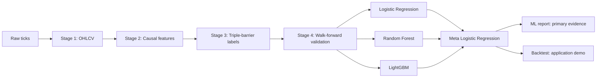

# Classic Hybrid Stacking for XAU/USD H1

## Evaluating Short-Term Signal Prediction for XAU/USD Time Series

This thesis project builds and evaluates a reproducible Machine Learning pipeline for predicting XAU/USD H1 trading signals: Short, Hold, and Long.

Current runtime architecture:

```text
Classic Hybrid Stacking
= Logistic Regression + Random Forest + LightGBM
  -> meta-model Logistic Regression
  -> Short / Hold / Long signal
```

The focus is not to prove a profitable CFD gold strategy. The primary thesis contribution is a controlled financial time-series ML workflow:

- causal feature engineering;
- triple-barrier labeling;
- walk-forward validation;
- purge/embargo to reduce leakage;
- baseline and model comparison;
- feature importance and model reporting.

Backtest results are included only as an application demo showing how predicted signals could be translated into trades. Classification metrics are the primary evidence.

Bachelor's thesis — Thuy Loi University

---

## Documentation

| Document | Description |
|:--|:--|
| [Architecture](docs/ARCHITECTURE.md) | Current 6-stage pipeline and Classic Hybrid Stacking design |
| [Quickstart](docs/QUICKSTART.md) | Install, run, and inspect outputs |
| [Evaluation](docs/EVALUATION.md) | How to read metrics and model comparison |
| [Configuration](docs/CONFIGURATION.md) | Important config fields and safe tuning surface |
| [Tuning Guide](docs/TUNING.md) | Safe order of changes: label -> feature -> model -> report |
| [Roadmap](docs/ROADMAP.md) | Completed and pending work |
| [Glossary](docs/GLOSSARY.md) | Plain-language terms |

---

## Quick Start

```bash
pixi install
pixi run workflow
```

Run from a specific stage:

```bash
pixi run python main.py --stage 3 --force
pixi run python main.py --stage 4 --force
```

Results are saved to:

```text
results/XAUUSD_1H_<timestamp>/
```

Latest verified session:

```text
results/XAUUSD_1H_20260513_023811/
```

---

## How It Works



The model works in two levels:

1. Base learners produce Short/Hold/Long probability estimates.
2. A meta Logistic Regression learns how to combine those probabilities.

The walk-forward split is time-safe: each train window is chronologically split into base-train and meta-train blocks. No random split is used for financial time-series evaluation.

---

## Commands

| Command | Description |
|---|---|
| `pixi run workflow` | Run full pipeline |
| `pixi run python main.py --stage 2 --force` | Rebuild features and downstream stages |
| `pixi run python main.py --stage 3 --force` | Rebuild labels and downstream stages |
| `pixi run python main.py --stage 4 --force` | Rerun model training and downstream stages |
| `pixi run ruff check src` | Lint source |
| `pixi run python -m compileall -q src tests` | Syntax/import compile check |
| `pixi run test-fast` | Fast test suite |
| `pixi run test` | Full test suite |

---

## Project at a Glance

| Detail | Value |
|---|---|
| Asset | XAU/USD |
| Timeframe | 1 hour |
| Data range | January 2021 – April 2026 |
| Validation | Walk-forward sliding window with purge/embargo |
| Model | Classic Hybrid Stacking |
| Base learners | Logistic Regression, Random Forest, LightGBM |
| Meta learner | Logistic Regression |
| Labels | Triple-barrier Short/Hold/Long |
| Primary output | Accuracy, Directional Accuracy, Macro F1, per-class F1, confusion matrix |
| Backtest | Application demo only |
| Python | 3.13 via Pixi |

---

## Project Structure

```text
src/thesis/
  stage_1_data/        Data preparation
  stage_2_features/    Feature engineering
  stage_3_labels/      Triple-barrier labeling
  stage_4_training/    Walk-forward stacking / LightGBM baseline
  stage_5_backtest/    Application-demo backtest
  stage_6_reporting/   Reports, metrics, charts
  shared/              Config, constants, schemas, utilities
```

GRU/deep sequence models are historical/experimental direction only. They are not the current production runtime.
