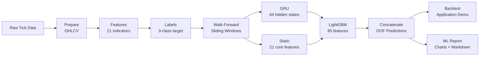
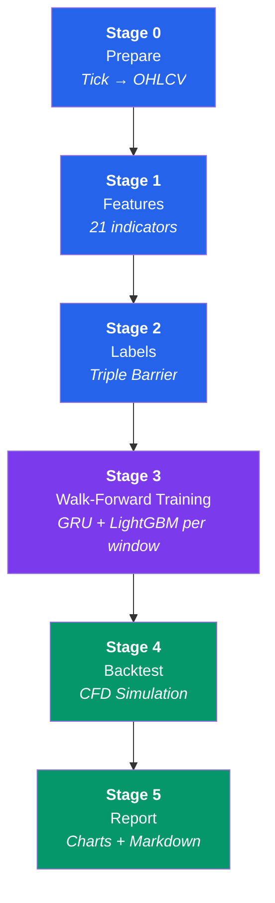
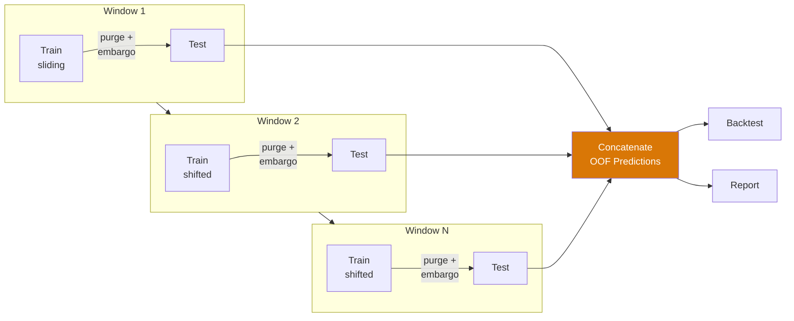
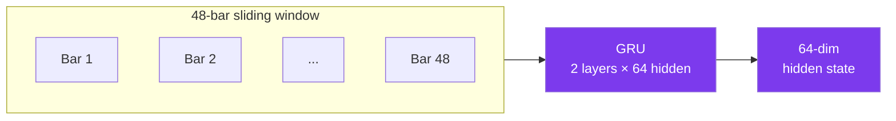
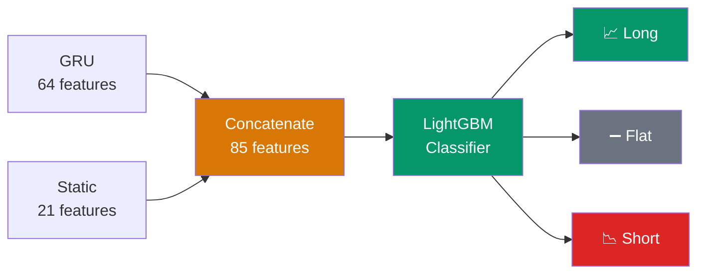
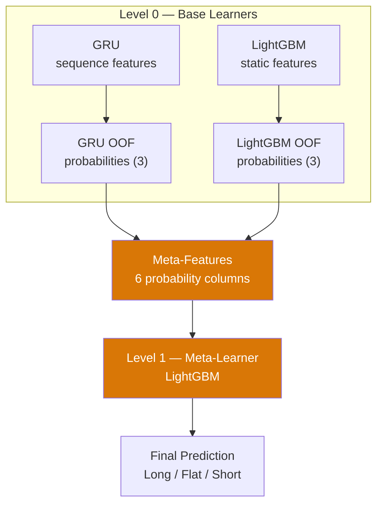
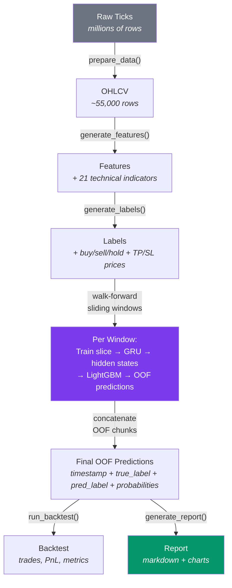
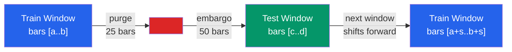
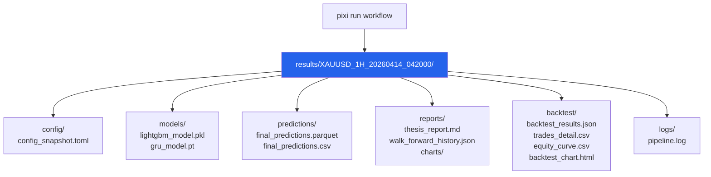
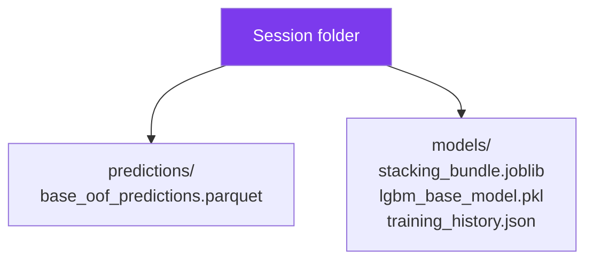

# Architecture

> A high-level overview of how this project is built.

---

## What Does This Project Do?

This project builds a reproducible **time-series classification pipeline** on
gold (XAU/USD) 1-hour data. It supports **two architectures**:

1. **Hybrid** (default) — GRU hidden states + static features → LightGBM.
2. **Stacking** — GRU and LightGBM as base learners → LightGBM meta-learner on OOF probabilities.

Both use **walk-forward sliding window validation** to produce out-of-fold predictions,
which are then backtested and reported.

The primary output is an ML evaluation report. The backtest is included as an
application demo for the predicted classes, not as the main thesis claim.

---

## The Big Picture



---

## Pipeline Stages

The pipeline has **6 stages** (0–5) in walk-forward mode (the default).



| # | Stage | What It Does | Input | Output |
|---|-------|-------------|-------|--------|
| 0 | **Prepare** | Convert raw tick data into 1-hour candle (OHLCV) bars | Raw parquet ticks | `ohlcv.parquet` |
| 1 | **Features** | Calculate 21 technical indicators (RSI, ATR, MACD, etc.) | `ohlcv.parquet` | `features.parquet` |
| 2 | **Labels** | Generate buy/sell/hold labels using the Triple Barrier method | `features.parquet` | `labels.parquet` |
| 3 | **Walk-Forward Training** | For each sliding window: train GRU → extract hidden states → train LightGBM → predict on test slice → collect OOF predictions | `labels.parquet` | `final_predictions.parquet` + model files |
| 4 | **Backtest** | Simulate CFD trading on concatenated OOF predictions | OOF predictions | `backtest_results.json` + `trades_detail.csv` |
| 5 | **Report** | Generate ML metrics, baseline comparison, charts, and application summary | All outputs | Charts + `thesis_report.md` |

> When `validation.method = "static"` in `config.toml`, stage 3 performs a
> traditional train/val/test split and single-pass LightGBM training instead of
> walk-forward. This mode is **not used** by default.

---

## Walk-Forward Validation

The pipeline uses a **sliding window** approach instead of a fixed train/val/test split.
This produces out-of-fold (OOF) predictions across multiple time windows, mimicking
real-world sequential deployment.



Each window:

1. **Slices** the labeled data into a train block and a test block.
2. **Applies purge and embargo** at the boundary (anti-leakage).
3. **Trains GRU** on the train slice (80/20 internal split for early stopping).
4. **Extracts GRU hidden states** for both train and test slices.
5. **Builds the hybrid feature matrix** (GRU hidden states + static indicators).
6. **Trains LightGBM** on the hybrid features.
7. **Predicts on the test slice** and collects as one OOF chunk.

After all windows: OOF chunks are concatenated into a single prediction file
for the backtest and report stages.

Default window parameters (configurable in `config.toml`):

| Parameter | Default | Description |
|-----------|---------|-------------|
| `train_window_bars` | 26 280 | ~3 years of H1 bars |
| `test_window_bars` | 4 380 | ~6 months of H1 bars |
| `step_bars` | 4 380 | Non-overlapping test windows |
| `purge_bars` | 25 | Bars removed at train/test boundary |
| `embargo_bars` | 50 | Additional gap after purge (~2 days) |
| `min_train_bars` | 10 000 | Minimum training bars per window |

---

## The Hybrid Model (Default Architecture)

This is the core innovation. Here is how it works step by step:

### Step 1: GRU Feature Extractor

The **GRU** (Gated Recurrent Unit) is a neural network that reads sequences of past prices.
Think of it like reading a sentence — it looks at the words one by one and builds an understanding of the whole context.



- **Input:** A sliding window of 48 hours using 8 normalized sequence features
  (`log_returns`, `atr_14`, `close_vs_ema_34`, `ema34_vs_ema89`, `candle_body_ratio`, `return_1h`, `return_4h`, `price_position_20`).
- **Output:** A 64-number vector (called "hidden states") that summarizes the temporal pattern.

### Step 2: LightGBM Decision Maker

**LightGBM** is a tree-based model (like a flowchart with many branches).
It takes the GRU's output plus the original 21 technical indicators and makes the final prediction.



- **Input:** 64 GRU hidden states + 21 static features = **85 features total**.
- **Output:** A prediction — **Long** (buy), **Short** (sell), or **Flat** (hold).

### Why Hybrid?

| Approach | Strength | Weakness |
|----------|----------|----------|
| GRU only | Captures time patterns | Misses indicator information |
| LightGBM only | Good with indicators | No sense of time order |
| **Hybrid** | **Captures both time + indicators** | More complex, slower to train |
| **Stacking** | **Learns optimal combination from data** | Needs more folds, longer training |

---

## Stacking Architecture (Alternative — Experimental)

> ⚠️ **Experimental**: Stacking mode is experimental and not the default workflow.
> The primary thesis pipeline uses **hybrid** mode. Do not use stacking for thesis
> defense unless explicitly discussed with your advisor.

When `model.architecture = "stacking"` is set in `config.toml`, the pipeline uses a
**two-level ensemble** instead of the simpler hybrid concatenation:



### How it works (per walk-forward window)

1. **Train base learners independently:**
   - **GRU base:** Trains on sequence features, produces 3-class probabilities on the test slice.
   - **LightGBM base:** Trains on static features, produces 3-class probabilities on the test slice.
2. **Collect base OOF probabilities** from both learners (`gru_pred_proba_class_*` + `lgbm_pred_proba_class_*`).
3. **Warm-up period:** The meta-learner requires a minimum number of prior folds before it starts training (`stacking.min_meta_train_folds`, default 1).
4. **Train meta-learner** (LightGBM) on the concatenated prior-fold base probabilities.
5. **Generate final predictions** from the meta-learner using the current fold's base probabilities.

After all windows, the pipeline can optionally **final-refit** both base models and the meta-learner
on the full dataset for deployment (`stacking.final_refit = true`).

Stacking-specific artifacts (in addition to the standard session output):

| Artifact | Description |
|----------|-------------|
| `predictions/base_oof_predictions.parquet` | All base-learner OOF probabilities |
| `models/stacking_bundle.joblib` | Deployable bundle with all model paths and config |
| `models/lgbm_base_model.pkl` | Final-refit LightGBM base model |
| `models/training_history.json` | Training details for base and meta models |

---

## Key Design Decisions

| Decision | Reason |
|----------|--------|
| **Walk-forward validation (default)** | Prevents look-ahead bias; mimics real sequential deployment |
| **Flat module layout** | Each pipeline stage is one file — easy to navigate, no nested packages |
| **GRU instead of LSTM** | Fewer parameters (25-30% less), less overfitting on small data |
| **No bidirectional GRU** | Prevents look-ahead bias (seeing future data) |
| **Small attention pooling** | Summarizes the 48-bar GRU output into one fixed-size embedding |
| **LightGBM as the decision maker** | Better interpretability, handles mixed feature types |
| **Stacking as opt-in alternative (experimental)** | Learns optimal base-model weighting from data; needs more folds; not recommended for thesis defense |
| **Polars instead of Pandas** | 10-50x faster for time-series operations |
| **Session-based output folders** | Each run is isolated — easy to compare experiments |
| **Correlation filtering on train only** | Prevents data leakage from test set |
| **Purge and embargo at each window boundary** | Prevents label leakage between train and test slices |
| **Triple Barrier labeling** | Realistic profit targets with a time limit |
| **Backtest as demo only** | Keeps the thesis focused on ML quality instead of trading optimization |
| **Fixed lot position sizing** | Keeps the application demo deterministic and easy to explain |

---

## Project Structure

```text
thesis/
├── config.toml              # All settings in one file
├── main.py                  # Entry point (CLI)
├── pixi.toml                # Package manager config
│
├── src/thesis/              # Source code (flat modules)
│   ├── config.py            # TOML config loader + dataclasses
│   ├── constants.py         # Shared constants and column lists
│   ├── session_paths.py     # Session directory path setup
│   ├── pipeline.py          # Stage orchestration (walk-forward + static)
│   ├── data.py              # Tick → OHLCV aggregation (Stage 0)
│   ├── features.py          # 21 technical indicators (Stage 1)
│   ├── labels.py            # Triple-barrier labeling (Stage 2)
│   ├── validation.py        # Walk-forward window generation + static split
│   ├── gru.py               # GRU feature extractor (train, predict, save)
│   ├── model.py             # LightGBM training (fixed params + Optuna)
│   ├── backtest.py          # CFD trading simulation (Stage 5)
│   ├── report.py            # Report + chart generation (Stage 5)
│   ├── charts.py            # Interactive ECharts (Streamlit)
│   ├── dashboard.py         # Streamlit dashboard
│   ├── zones.py             # Metric zone classification
│   └── ui.py                # Rich console utilities
│
├── scripts/
│   └── data_download.py     # Market data ingestion
│
├── tests/                   # Test suite
│   ├── conftest.py
│   ├── unit/                # Unit tests per module
│   └── integration/         # End-to-end tests
│
├── data/
│   ├── raw/XAUUSD/          # Raw tick data (monthly files)
│   └── processed/           # Generated parquet files
│
├── results/                 # Session-based outputs
│   └── {SYMBOL}_{TF}_{TIMESTAMP}/
│       ├── config/          # Config snapshot
│       ├── models/          # Saved models (LightGBM + GRU)
│       ├── predictions/     # Predictions (parquet + CSV)
│       ├── reports/         # Report + charts + walk_forward_history.json
│       ├── backtest/        # Trading results + trade details CSV
│       └── logs/            # Pipeline log (ANSI-stripped)
│
└── docs/                    # Documentation (you are here)
```

### Core vs Optional Modules

**Core modules** — required to run the main pipeline (`pixi run workflow`):

| Module | Role |
|--------|------|
| `data.py` | Stage 0: Tick → OHLCV |
| `features.py` | Stage 1: 21 technical indicators |
| `labels.py` | Stage 2: Triple-barrier labeling |
| `validation.py` | Walk-forward window generation |
| `gru.py` | GRU feature extractor |
| `model.py` | LightGBM training |
| `backtest.py` | Stage 5: CFD simulation |
| `report.py` | Stage 5: Report + charts |
| `pipeline.py` | Stage orchestration |
| `config.py` | TOML config → dataclasses |

**Optional modules** — not required for the batch pipeline:

| Module | Role |
|--------|------|
| `charts.py` | Interactive ECharts visualizations (Streamlit) |
| `dashboard.py` | Streamlit dashboard UI |
| `zones.py` | Metric zone classification for dashboard |
| `ui.py` | Rich console formatting utilities |

---

## Data Flow

Here is what happens to the data at each step:



---

## Anti-Leakage Protection

Data leakage is when information from the future accidentally "leaks" into the training data.
This project uses **three layers** of protection, applied **dynamically at each walk-forward window boundary**:



1. **Purge** — Removes 25 bars at each train/test boundary to prevent overlap
   from the label look-ahead window.
2. **Embargo** — Adds 50 extra bars of gap after each boundary (~2 days,
   covers the 48-bar label horizon).
3. **Correlation filtering on train only** — Feature selection uses only training data.

These gaps apply at **every window boundary**, not just at fixed dates.
The window indices are computed dynamically by `validation.generate_windows()`
based on the total bar count and the configured window sizes.

---

## Session-Based Output

Every time you run the pipeline, a new **session folder** is created:



**Additional stacking artifacts** (when `model.architecture = "stacking"`):



This means:
- Old results are never overwritten.
- You can compare different parameter settings.
- Each session has its own log (ANSI-stripped for clean file output), config snapshot, and all outputs.
- `walk_forward_history.json` records the exact window indices and OOF row counts for reproducibility.
