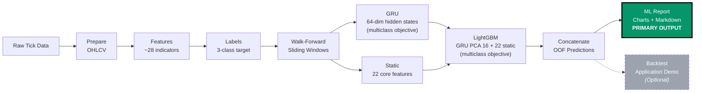
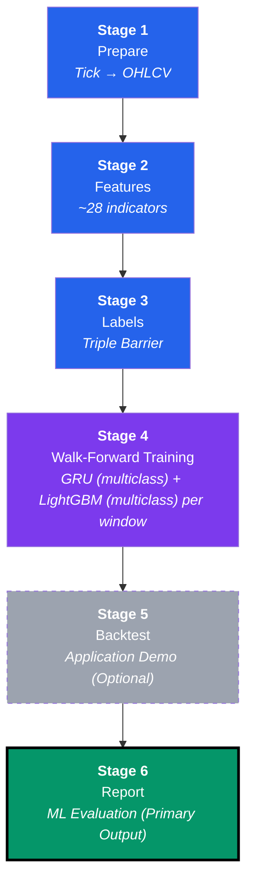
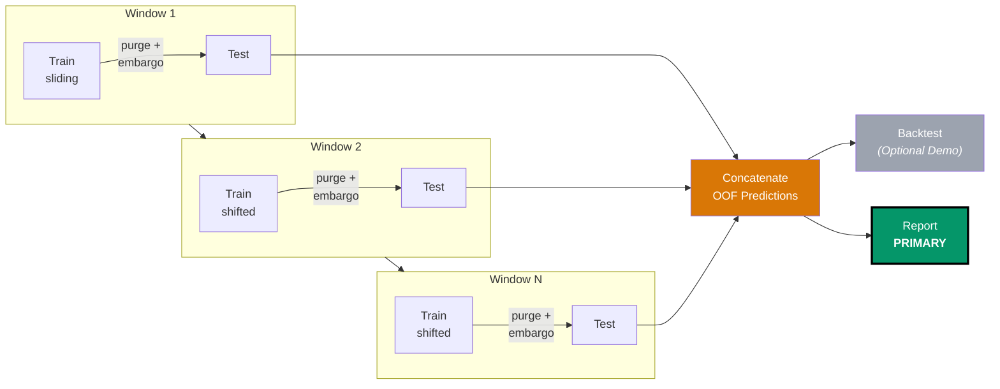
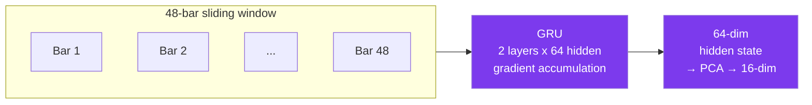
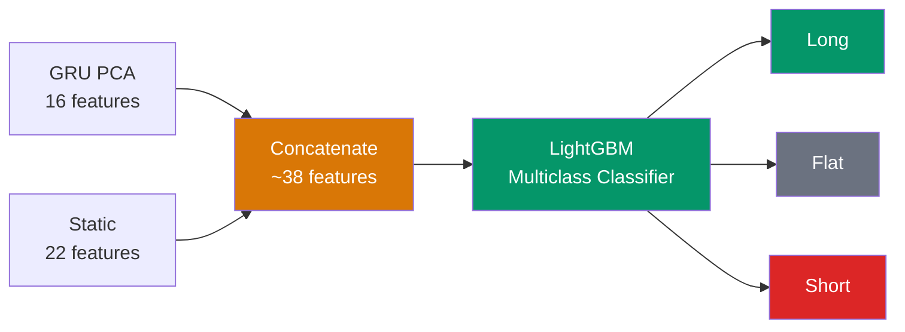
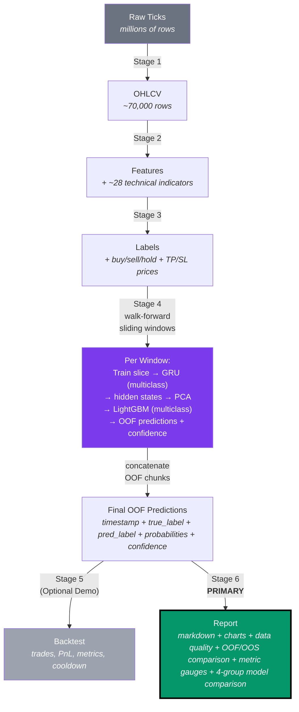
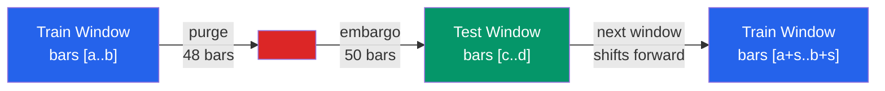
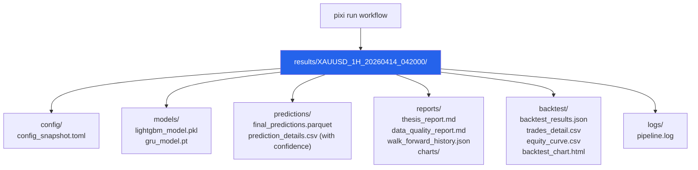

# Architecture

> A high-level overview of how this project is built.

---

## What Does This Project Do?

This project builds a reproducible **time-series classification pipeline** on
gold (XAU/USD) 1-hour data. It uses the **hybrid architecture**:

GRU hidden states (multiclass-trained) + static features → LightGBM (classifier).

The GRU is trained with **multiclass focal loss** to extract class-discriminative
temporal embeddings. LightGBM then uses those embeddings alongside tabular
features for **3-class prediction** (Short/Hold/Long). Regression embeddings are
available for experiments but are not the stable default.

It uses **walk-forward sliding window validation** to produce out-of-fold predictions,
which are then evaluated and reported.

### Evaluation-First Principle

The **primary output** of this pipeline is the **ML model evaluation report** —
classification metrics, model comparison tables, data quality evidence, and
metric zone gauges. This is the thesis claim.

The backtest (Stage 5) is an **optional application demo** that translates predicted
classes into a simulated trading narrative. It is NOT a primary proof of model
quality. Backtest results depend heavily on execution assumptions (lot size,
spread, cooldown, slippage) and should not be used as standalone evidence.

### Model Comparison Groups

The pipeline compares **4 model groups** to isolate each component's contribution:

| Group | Architecture | Purpose |
|-------|-------------|---------|
| **Naive Direction** | Previous-bar direction → prediction | Baseline (no learning) |
| **LightGBM Static** | 22 static features only | Tabular feature ceiling |
| **GRU-only** | GRU hidden states only | Temporal feature ceiling |
| **Hybrid GRU+LightGBM** | GRU PCA 16 + 22 static → LightGBM | Full system (thesis contribution) |

### Metric Hierarchy

Metrics are prioritized by their relevance to the thesis claim:

1. **Classification (primary)** — Directional Accuracy, Macro F1, Confusion Matrix,
   per-class Precision/Recall. These directly measure the 3-class prediction quality.
2. **Regression auxiliary** — MAE, RMSE, R² on forward returns. These provide
   supporting evidence about prediction magnitude but are not the thesis target.

---

## The Big Picture



---

## Pipeline Stages

The pipeline has **6 stages** (1–6) in walk-forward mode (the default),
organized as subpackages under `src/thesis/`.



| # | Stage | Module | What It Does | Input | Output |
|---|-------|--------|-------------|-------|--------|
| 1 | **Prepare** | `stage_1_data/` | Convert raw tick data into 1-hour candle (OHLCV) bars | Raw parquet ticks | `ohlcv.parquet` |
| 2 | **Features** | `stage_2_features/` | Calculate ~28 technical indicators + regime features | `ohlcv.parquet` | `features.parquet` |
| 3 | **Labels** | `stage_3_labels/` | Generate buy/sell/hold labels using the Triple Barrier method | `features.parquet` | `labels.parquet` |
| 4 | **Walk-Forward Training** | `stage_4_training/` | Per window: train GRU (multiclass) → extract hidden states → train LightGBM (multiclass) → predict test slice → collect OOF predictions | `labels.parquet` | `final_predictions.parquet` + model files |
| 5 | **Backtest** *(optional demo)* | `stage_5_backtest/` | Simulate CFD trading on concatenated OOF predictions with cooldown, confidence filtering, and fixed lot size. **Application demo, not primary proof.** | OOF predictions | `backtest_results.json` + `trades_detail.csv` |
| 6 | **Report** *(primary output)* | `stage_6_reporting/` | ML evaluation metrics, 4-group model comparison, data quality analysis, OOF/OOS comparison, metric zone gauges, charts, and thesis report. **This is the thesis claim.** | All outputs | Charts + `thesis_report.md` |

> When `validation.method = "static"` in `config.toml`, stage 4 performs a
> traditional train/val/test split and single-pass LightGBM training instead of
> walk-forward. This mode is **not used** by default.

---

## Walk-Forward Validation

The pipeline uses a **sliding window** approach instead of a fixed train/val/test split.
This produces out-of-fold (OOF) predictions across multiple time windows, mimicking
real-world sequential deployment.



Each window:

1. **Slices** the labeled data into a train block and a test block.
2. **Applies purge and embargo** at the boundary (anti-leakage).
3. **Trains GRU** with **multiclass focal loss** on the same Short/Hold/Long labels
   used by LightGBM. GRU validation is the last 20% of the outer train block and
   uses cosine-annealing LR schedule with warm restarts and early stopping.
4. **Computes distribution-shift weights** (clipped [0.5, 3.0]) between train
   and val label distributions to correct for temporal label drift.
5. **Extracts GRU hidden states** for both train and test slices. Hidden states
   may be reduced via PCA (default 16 dims) before passing to LightGBM.
6. **Builds the hybrid feature matrix** (GRU PCA features + 22 static indicators
   = ~38 features).
7. **Trains LightGBM** as a **3-class classifier** on the hybrid features.
   LightGBM validation is the last 20% of the outer train and uses tree early
   stopping.
8. **Predicts on the test slice** and collects as one OOF chunk, including
   probabilities and confidence scores.
9. **Records window diagnostics**: per-class metrics, class weights, shift
   weights, and OOF row counts for reproducibility.

After all windows: OOF chunks are concatenated into a single prediction file
for the backtest and report stages.

Default window parameters (configurable in `config.toml`):

| Parameter | Default | Description |
|-----------|---------|-------------|
| `train_window_bars` | 17 520 | ~2 years of H1 bars |
| `test_window_bars` | 4 380 | ~6 months of H1 bars |
| `step_bars` | 4 380 | Non-overlapping test windows |
| `purge_bars` | 48 | Bars removed at train/test boundary |
| `embargo_bars` | 50 | Additional gap after purge (~2 days) |
| `min_train_bars` | 10 000 | Minimum training bars per window |

---

## The Hybrid Model (Default Architecture)

This is the core innovation. Here is how it works step by step:

### Step 1: GRU Feature Extractor (Multiclass Objective)

The **GRU** (Gated Recurrent Unit) is a neural network that reads sequences of past prices.
It is trained with **multiclass focal loss** on Short/Hold/Long labels so its hidden states
preserve class-discriminative information for the downstream classifier.



- **Input:** A sliding window of 48 hours using **20 normalized sequence features**
  including raw OHLCV z-scores (`open_norm`, `high_norm`, `low_norm`, `close_norm`),
  regime indicators (`adx_14`, `ema_slope_20`, `regime_strength`), relative
  volatility (`atr_pct_close`, `atr_ratio`), and ATR-normalized momentum (`macd_hist_atr`).
- **Training:** Cosine-annealing LR schedule with warm restarts (T_0=10, T_mult=2),
  3 warmup epochs, gradient clipping (max norm 1.0), and plateau detection.
- **Objective:** 3-class focal loss. Regression embeddings remain available as an
  experiment but are not the stable default after degraded OOS class signal.
- **Output:** A 64-number vector (hidden states), optionally reduced to 16 dims via
  PCA for the downstream LightGBM.

### Step 2: LightGBM Decision Maker (Multiclass Classifier)

**LightGBM** is a tree-based model that takes the GRU embeddings plus the 22 static
indicators and makes the final **3-class prediction**.



- **Input:** PCA-reduced GRU hidden states + 22 static features = **~38 features total**.
- **Output:** A prediction — **Long** (buy), **Short** (sell), or **Flat** (hold).
- **Distribution shift correction:** Per-window class weights are computed between train
  and validation label distributions, clipped to [0.5, 3.0], to correct for temporal
  label drift during market regime changes.

### Why Multiclass GRU by Default?

| GRU Objective | LightGBM Objective | Result |
|--------------|-------------------|--------|
| **Multiclass (focal loss)** | **Multiclass** | **Preserves class-discriminative hidden states for Short/Hold/Long** |
| Regression (MSE) | Multiclass | Experimental; latest OOS run collapsed class signal in late windows |

Regression GRU embeddings are still supported for experiments, but the stable thesis
default is multiclass GRU + multiclass LightGBM because the OOS target is a 3-class
decision problem.

---

## Key Design Decisions

| Decision | Reason |
|----------|--------|
| **GRU multiclass, LightGBM multiclass** | Stable OOS default; preserves class signal for the 3-class thesis target. |
| **Walk-forward validation (default)** | Prevents look-ahead bias; mimics real sequential deployment |
| **Stage-based subpackage layout** | Each pipeline stage is a subpackage under `src/thesis/` — clear separation, testable in isolation |
| **GRU instead of LSTM** | Fewer parameters (25-30% less), less overfitting on small data |
| **Bidirectional GRU (optional)** | Available via config but disabled by default — avoids look-ahead bias |
| **Attention pooling** | Summarizes the 48-bar GRU output into one fixed-size embedding |
| **PCA on GRU hidden states** | Reduces 64-dim → 16-dim, removes redundancy before LightGBM |
| **LightGBM as the decision maker** | Better interpretability, handles mixed feature types |
| **Polars instead of Pandas** | 10-50x faster for time-series operations |
| **Session-based output folders** | Each run is isolated — easy to compare experiments |
| **Correlation filtering on train only** | Prevents data leakage from test set |
| **Purge and embargo at each window boundary** | Prevents label leakage between train and test slices |
| **Triple Barrier labeling** | Realistic profit targets with a time limit (2xATR barriers) |
| **Distribution-shift weights** | Per-window class weights correct for label distribution drift |
| **Trade cooldown (min_bars_between_trades=6)** | Prevents overtrading, reduces correlation between consecutive trades |
| **Fixed lot sizing after confidence filter** | Prevents confidence from amplifying wrong high-conviction predictions |
| **Backtest as demo only** | Keeps the thesis focused on ML quality instead of trading optimization |
| **4-group model comparison** | Naive Direction, LightGBM Static, GRU-only, Hybrid GRU+LightGBM — isolates each component's contribution |
| **Classification-first metric hierarchy** | Directional Accuracy / Macro F1 / Confusion Matrix (primary) > MAE/RMSE/R² (auxiliary). Thesis claim rests on classification. |
| **Cosine-annealing LR schedule** | Warm restarts improve GRU convergence on non-stationary financial data |

---

## Project Structure

```text
thesis/
├── config.toml                  # All settings in one file
├── main.py                      # Entry point (CLI)
├── pixi.toml                    # Package manager config
│
├── src/thesis/                  # Source code (stage-based subpackages)
│   ├── __init__.py
│   ├── shared/                 # Shared utilities
│   │   ├── config.py            # TOML config loader + dataclasses
│   │   ├── constants.py         # Shared constants, feature lists, timeframe_to_ms()
│   │   ├── session_paths.py     # Session directory path setup
│   │   ├── ui.py                # Rich console utilities
│   │   └── zones.py             # Metric zone classification
│   ├── stage_1_data/            # Stage 1: Tick → OHLCV aggregation
│   ├── stage_2_features/        # Stage 2: Feature engineering (~28 indicators)
│   │   ├── engineering.py       # Orchestrator + regime/session features
│   │   └── indicators/          # Technical indicator sub-package
│   │       ├── __init__.py
│   │       ├── core.py          # RSI, ATR, MACD, session, pivot indicators
│   │       └── trend.py         # EMA crossovers, ADX, slopes, regime, volume
│   ├── stage_3_labels/          # Stage 3: Triple-barrier labeling
│   ├── stage_4_training/        # Stage 4: Walk-forward + GRU + LightGBM
│   │   ├── baselines.py         # Naive, majority-class, random baselines
│   │   ├── validation.py        # Walk-forward window generation + static split
│   │   ├── gru/                 # GRU sub-package
│   │   │   ├── arch.py          # GRU model definition + attention pooling
│   │   │   ├── calibration.py   # Temperature scaling
│   │   │   ├── data.py          # Sequence dataset + feature normalization
│   │   │   ├── inference.py     # Hidden-state extraction + PCA
│   │   │   ├── losses.py        # Focal loss + triplet loss
│   │   │   ├── persistence.py   # Model save/load
│   │   │   └── training.py      # Training loop + LR schedule + early stopping
│   │   ├── lgbm/                # LightGBM sub-package
│   │   │   ├── training.py      # LightGBM training, hybrid feature building
│   │   │   └── utils.py         # LightGBM helpers (split, weights, metrics)
│   │   └── walk_forward/        # Walk-forward sub-package
│   │       ├── artifacts.py     # Window artifact persistence
│   │       ├── dispatcher.py    # Window orchestration dispatcher
│   │       ├── hybrid.py        # Hybrid GRU+LGBM per-window training
│   │       ├── static.py        # Static split single-pass training
│   │       └── utils.py         # Window metrics + OOF assembly
│   ├── stage_5_backtest/        # Stage 5: CFD trading simulation
│   │   ├── simulation.py        # Backtest orchestrator
│   │   ├── strategy.py          # Strategy logic + ATR stops + circuit breakers
│   │   ├── persistence.py       # Results + trades CSV + equity CSV export
│   │   └── runners.py           # Backtesting.py runner + stats collection
│   ├── stage_6_reporting/       # Stage 6: Report + chart generation
│   │   ├── generation.py        # Report orchestrator
│   │   ├── benchmarks.py        # Naive/majority/random/buy-hold baselines
│   │   ├── calibration.py       # ECE, Brier score, reliability diagrams
│   │   ├── charts.py            # Static chart generation (matplotlib)
│   │   ├── comparison.py        # 4-group model comparison tables
│   │   ├── data_quality.py      # Missing bars, OHLCV consistency, volatility
│   │   ├── model_metrics.py     # Classification + regression metric computation
│   │   ├── tables.py            # Markdown table formatting utilities
│   │   └── sections/            # Report sections sub-package
│   │       ├── assess.py        # Model assessment section
│   │       ├── backtest.py      # Backtest results section
│   │       ├── data.py          # Data quality section
│   │       └── oof.py           # OOF/OOS comparison section
│   ├── charts/                  # Interactive ECharts (Streamlit)
│   │   ├── __init__.py
│   │   ├── loader.py            # Session artifact loading for charts
│   │   ├── shared.py            # Shared chart constants + typing helpers
│   │   ├── backtest.py          # Backtest charts
│   │   ├── data.py              # Data exploration charts
│   │   └── model.py             # Model analysis charts
│   ├── dashboard/               # Streamlit dashboard (entry via main.py)
│   │   ├── __init__.py
│   │   ├── main.py              # Entry point + sidebar + section dispatch
│   │   ├── backtest.py          # Backtest performance tab
│   │   ├── cards.py             # Metric zone cards
│   │   ├── data.py              # Data exploration tab
│   │   ├── model.py             # Model analysis tab
│   │   ├── reports.py           # Reports browsing tab
│   │   ├── session.py           # Session selection + config loading
│   │   ├── shared.py            # Dashboard shared helpers
│   │   └── training.py          # Training diagnostics tab
│   └── pipeline.py              # Stage orchestration (top-level runner)
│
├── scripts/
│   └── data_download.py         # Market data ingestion
│
├── tests/                       # Test suite
│   ├── conftest.py
│   ├── unit/                    # Unit tests per module
│   └── integration/             # End-to-end tests
│
├── data/
│   ├── raw/XAUUSD/              # Raw tick data (monthly files)
│   └── processed/               # Generated parquet files
│
├── results/                     # Session-based outputs
│   └── {SYMBOL}_{TF}_{TIMESTAMP}/
│       ├── config/              # Config snapshot
│       ├── models/              # Saved models (LightGBM + GRU)
│       ├── predictions/         # Predictions (parquet + CSV with confidence cols)
│       ├── reports/             # Report + charts + walk_forward_history.json
│       ├── backtest/            # Trading results + trade details CSV
│       └── logs/                # Pipeline log (ANSI-stripped)
│
└── docs/                        # Documentation (you are here)
```

### Core vs Optional Modules

**Core modules** — required to run the main pipeline (`pixi run workflow`):

| Module | Role |
|--------|------|
| `stage_1_data/` | Stage 1: Tick → OHLCV |
| `stage_2_features/` | Stage 2: ~28 technical indicators + regime features |
| `stage_3_labels/` | Stage 3: Triple-barrier labeling |
| `stage_4_training/validation.py` | Walk-forward window generation |
| `stage_4_training/gru/` | GRU feature extractor (arch, training, losses, calibration, inference, persistence) |
| `stage_4_training/lgbm/` | LightGBM training + helpers (`training.py`, `utils.py`) |
| `stage_4_training/walk_forward/` | Walk-forward orchestration (dispatcher, hybrid, static, artifacts, utils) |
| `stage_4_training/baselines.py` | Naive/majority/random/buy-hold baselines |
| `stage_5_backtest/` | Stage 5: CFD simulation with cooldown *(optional application demo)* |
| `stage_6_reporting/` | Stage 6: Report + charts + metric zones + sections sub-package |
| `pipeline.py` | Stage orchestration |
| `shared/config.py` | TOML config → dataclasses |
| `shared/constants.py` | Shared constants, `timeframe_to_ms()` |

**Optional modules** — not required for the batch pipeline:

| Module | Role |
|--------|------|
| `charts/` | Interactive ECharts visualizations (Streamlit) |
| `dashboard/` | Streamlit dashboard UI (10 modules) |
| `shared/zones.py` | Metric zone classification for dashboard + report |
| `shared/ui.py` | Rich console formatting utilities |

---

## Data Flow

Here is what happens to the data at each step:



---

## Anti-Leakage Protection

Data leakage is when information from the future accidentally "leaks" into the training data.
This project uses **three layers** of protection, applied **dynamically at each walk-forward window boundary**:



1. **Purge** — Removes 48 bars at each train/test boundary to prevent overlap
   from the label look-ahead window and exceed typical 24-bar holding horizons.
2. **Embargo** — Adds 50 extra bars of gap after each boundary (~2 days,
   covers the 48-bar label horizon).
3. **Correlation filtering on train only** — Feature selection uses only training data.

These gaps apply at **every window boundary**, not just at fixed dates.
The window indices are computed dynamically by `validation.generate_windows()`
based on the total bar count and the configured window sizes.
These are **bar-based** windows: the calendar duration is approximate and can
vary when weekends, holidays, or missing bars are present.

---

## Session-Based Output

Every time you run the pipeline, a new **session folder** is created:



This means:
- Old results are never overwritten.
- You can compare different parameter settings.
- Each session has its own log (ANSI-stripped for clean file output), config snapshot, and all outputs.
- `walk_forward_history.json` records per-window diagnostics: class weights, shift weights, per-class metrics, and OOF row counts for reproducibility.
- `prediction_details.csv` includes confidence scores and probabilities for every prediction row.
