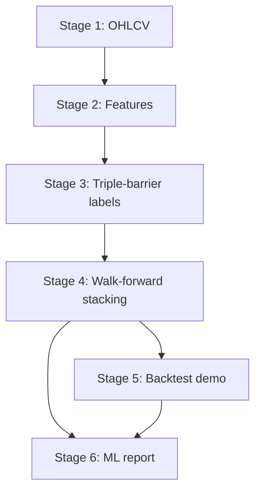

# Architecture

This document describes the current runtime architecture of the XAU/USD H1 thesis pipeline.

---

## Current Runtime

```text
Classic Hybrid Stacking
= Logistic Regression + Random Forest + LightGBM
  -> meta-model Logistic Regression
  -> Short / Hold / Long prediction
```

The pipeline is a financial time-series classification workflow. It uses walk-forward validation and treats ML classification metrics as the main thesis evidence.

GRU/deep sequence paths are historical experiment ideas only. They are not the current runtime.

---

## Evaluation-First Principle

Primary evidence:

- Accuracy
- Directional Accuracy
- Macro F1
- Per-class Precision / Recall / F1
- Confusion matrix
- Baseline and model comparison

Backtest is secondary. It is an application demo that shows how model signals could be translated into trades. It is not proof of profitability.

---

## Project Structure

```text
src/thesis/
├── stage_1_data/             Data preparation (raw ticks -> OHLCV)
├── stage_2_features/         Feature engineering (indicators + transforms)
│   ├── engineering.py        Production feature pipeline orchestrator
│   ├── indicators.py         Polars-native indicator helpers (RSI, ATR, MACD, ADX, etc.)
│   └── _indicators/          Sub-module for grouped indicator logic
├── stage_3_labels/           Triple-barrier label generation
│   └── labeling.py           Direction-barrier labeling with Numba acceleration
├── stage_4_training/         Model training and walk-forward validation
│   ├── baselines.py          Baseline prediction strategies (random, majority, naive)
│   ├── validation.py         Walk-forward window generator with purge/embargo
│   ├── lgbm/                 LightGBM-specific utilities
│   │   └── utils.py          Training helpers, feature group constraints
│   └── walk_forward/         Walk-forward training subsystem
│       ├── dispatcher.py     Routes to stacking or lgbm architecture
│       ├── stacking.py       Classic Hybrid Stacking implementation
│       ├── lgbm.py           LightGBM-only walk-forward training
│       ├── artifacts.py      OOF prediction and model artifact persistence
│       ├── targets.py        Target/label preparation utilities
│       └── utils.py          Shared walk-forward helpers
├── stage_5_backtest/         Application-demo CFD backtest
│   ├── strategy.py           MLSignalStrategy for backtesting.py
│   ├── simulation.py         FractionalBacktest wrapper
│   ├── runners.py            Backtest execution and result normalization
│   └── persistence.py        Save metrics, trades, equity curve, charts
├── stage_6_reporting/        Report generation
│   ├── generation.py         Markdown report builder
│   ├── sections/             Sub-section renderers (data quality, model assessment, etc.)
│   ├── benchmarks.py         Benchmark comparison (random, majority, naive strategies)
│   ├── calibration.py        ECE, Brier score, confidence bins
│   ├── comparison.py         Model comparison table rendering
│   ├── model_metrics.py      Classification metric computation
│   ├── charts.py             Pyecharts chart builders
│   ├── tables.py             Table formatting helpers
│   ├── md_format.py          Markdown formatting utilities
│   └── data_quality.py       Data quality section renderer
├── shared/                   Cross-stage shared code
│   ├── config.py             TOML config loader + dataclass definitions
│   ├── constants.py          Exclusion sets, feature lists, numerical epsilons
│   ├── feature_registry.py   Canonical column list definitions
│   ├── schemas.py            Pandera validation schemas for OHLCV, features, labels
│   ├── session_paths.py      Session directory management
│   ├── ui.py                 CLI output helpers (SimpleConsole)
│   ├── zones.py              Metric quality zone definitions
│   └── data_quality.py       OHLCV quality checks (gap, candle consistency, outliers)
├── charts/                   Interactive dashboard chart builders
├── dashboard/                Streamlit dashboard application
├── pipeline.py               6-stage pipeline orchestrator with caching
```

---

## Pipeline Stages

| # | Stage | Module | Input | Output | Config Section |
|---|---|---|---|---|---|
| 1 | Data Preparation | `stage_1_data/` | Raw ticks | `ohlcv.parquet` | `[data]` |
| 2 | Feature Engineering | `stage_2_features/` | OHLCV | `features.parquet` + feature list sidecar | `[features]` |
| 3 | Label Generation | `stage_3_labels/` | Features + ATR helper | `labels.parquet` | `[labels]` |
| 4 | Model Training | `stage_4_training/` | Labels | predictions, model artifacts, model comparison | `[model]`, `[validation]` |
| 5 | Backtest | `stage_5_backtest/` | OOF predictions | backtest metrics, trades, equity curve, charts | `[backtest]`, `[labels]` |
| 6 | Reporting | `stage_6_reporting/` | All outputs | thesis report, metric files, dashboard data | (none) |



### Execution Contract

`--stage N` means "start at Stage N and continue through Stage 6". No `--stage` means the same as `--stage 1` (run all). Running `--stage 3` skips only Stages 1-2 and continues through 3-6.

---

## Stage 1: Data Preparation

Downloads and aggregates raw tick data into OHLCV bars. The module uses Dukascopy data sources and aggregates to the configured timeframe (default: 1H).

Key outputs:
- `ohlcv.parquet` with columns: `timestamp`, `open`, `high`, `low`, `close`, `volume`, `tick_count`, `avg_spread`
- `data_quality.json` with gap report, candle quality stats, and outlier analysis

Data quality checks include: high >= low, open/close within [low, high], volume >= 0, calendar gap classification, and outlier return detection.

---

## Stage 2: Feature Engineering

Computes 21 causal tabular features grouped into 6 categories. All features are non-lookahead (no `shift(-n)`, no `center=True` in rolling/ewm).

### Feature Categories

| Category | Features | Description |
|---|---|---|
| **Trend** | `ema34_vs_ema89`, `close_vs_ema_34`, `adx_14`, `ema_slope_20` | EMA crossover distance, ADX strength, EMA slope |
| **Momentum** | `return_1h`, `return_4h`, `macd_hist_atr`, `rsi_14` | Multi-horizon returns, ATR-normalized MACD, RSI |
| **Volatility** | `atr_pct_close`, `atr_ratio`, `atr_percentile`, `high_low_range_20` | ATR metrics, rolling range |
| **Position** | `price_dist_ratio`, `price_position_20`, `pivot_position`, `vwap` | Price relative to indicators, session VWAP |
| **Candle** | `candle_body_ratio` | Body-to-range ratio |
| **Session** | `sess_asia`, `sess_london`, `sess_ny_am`, `sess_ny_pm` | 24/5 market session dummies (NY timezone anchored) |

### Feature Pipeline Flow

1. ATR computation (Wilder-smoothed, period 14)
2. Context features: ATR ratio, price distance from EMA89, VWAP, pivot position, session dummies, ATR percentile
3. Price action: candle body ratio, wick ratios, gap ratio, consecutive bars, price position
4. EMA crossover: close vs EMA34 distance, EMA34 vs EMA89 distance (ATR-normalized)
5. Log returns: 1h, 4h, 24h returns
6. High-low range (ATR-normalized, window 20)
7. ADX (Wilder trend strength)
8. EMA slope (5-bar percent change)
9. Regime strength (ADX * EMA slope sign)
10. RSI (Wilder, period 14)
11. MACD (histogram + ATR-normalized)
12. Volume z-score (rolling 20)
13. OHLCV normalized (rolling z-score, window 20)

After computation:
- Warmup rows (null features from rolling windows) are dropped
- Feature quality is validated (Pandera schema, null check, uniqueness, monotonicity)
- Feature list sidecar JSON is written

### Pruned Features

The following were removed for low/zero importance:

| Feature | Reason |
|---|---|
| `regime_strength` | Low importance, composite of existing ADX/slope |
| `upper_wick_ratio` | Low importance |
| `lower_wick_ratio` | Low importance |
| `volume_zscore_20` | Noisy, hard to defend |

### Exclusion Rules

Raw OHLCV (`open`, `high`, `low`, `close`, `volume`), label-derived columns (`label`, `upper_barrier`, `lower_barrier`, `touched_bar`, `event_end`, `sample_weight`), and metadata (`timestamp`, `avg_spread`, `tick_count`, `atr_14`, `log_returns`) are excluded from model input. The canonical exclusion set is defined in `src/thesis/shared/constants.py:EXCLUDE_COLS`.

---

## Stage 3: Label Generation

Uses asymmetric direction-barrier labeling with Numba-accelerated computation.

### Label Encoding

| Value | Meaning |
|---|---|
| `+1` | Long (upper barrier hit first) |
| `0` | Hold (timeout, no barrier hit) |
| `-1` | Short (lower barrier hit first) |
| `-2` | Censored (insufficient forward horizon, dropped before training) |

### Barrier Computation

```text
upper_barrier = close[i] + atr_tp_multiplier * max(atr[i], min_atr)
lower_barrier = close[i] - atr_sl_multiplier * max(atr[i], min_atr)
```

For each bar, scan forward up to `horizon_bars`. First barrier touched determines the label. Same-bar ambiguous hits (both barriers) are treated as Hold.

### Sample Weights

Average-uniqueness weights (Lopez de Prado) are computed from event concurrency to reduce overlap bias. Weights are normalized to mean 1.0 with a floor of 0.05.

### Profitability Check

After labeling, the module logs the percentage of Long/Short labels that are profitable after simulated trading costs (spread + slippage + commission). A warning fires if both directions fall below 60%.

---

## Stage 4: Model Training

### Walk-Forward Validation

Sliding windows over chronological data. No random splits.

```text
|<-- train window (6240 bars, ~1 year) -->|<-- test (1040 bars, ~2 months) -->|
                                            ^-- purge gap (48 bars)
                                            ^-- embargo gap (50 bars)
```

Parameters:
- `train_window_bars = 6240` (~1 market year at 24h/5d)
- `test_window_bars = 1040` (~2 market months)
- `step_bars = 1040` (non-overlapping)
- `purge_bars = 48` (gap between train and test to remove label lookahead)
- `embargo_bars = 50` (additional gap after test to prevent overlap)

### Classic Hybrid Stacking

Each outer walk-forward window is split chronologically:

```text
train window
  first 80%  -> train base learners (on training data)
  last 20%   -> train meta learner (on validation data, stacking_meta_fraction)

test window
  -> evaluate final stacked prediction
```

Base learners:
- **Logistic Regression**: linear baseline
- **Random Forest**: bagging tree baseline (300 trees, max_depth=6, min_samples_leaf=80)
- **LightGBM**: boosting tree learner (num_leaves=15, max_depth=4, lr=0.03, n_estimators=300)

Meta learner:
- Logistic Regression over the class-probability outputs of the base learners

The meta-feature matrix is built from probabilities for the class order: Short, Hold, Long.

Additional features:
- Distribution-shift weights: per-sample weights to reduce stale-regime bias (clipped to [0.5, 3.0])
- Class weight computation: balanced class weights for imbalanced data
- Validation filtering: drops validation rows whose class is absent from training fold

### LightGBM-Only Ablation

Setting `architecture = "lgbm"` runs LightGBM-only walk-forward training without stacking. This serves as a strong simple baseline.

### Model Comparison

Reports compare all models:

| Model | Type |
|---|---|
| Naive Direction | Previous-bar persistence |
| Majority Class | Always predict most common class |
| Random | Random class assignment |
| Logistic Regression | Base learner standalone |
| Random Forest | Base learner standalone |
| LightGBM | Base learner standalone |
| Hybrid Stacking | Meta learner over all base learners |

### Baselines

Four baseline strategies are computed for comparison:
1. **Naive Direction**: predict the direction of the previous bar's return (persistence)
2. **Majority Class**: always predict the most common class
3. **Random**: random class predictions
4. **Always Predict Class**: predict a fixed class label

All baselines operate on the same walk-forward windows as the model for fair comparison.

---

## Stage 5: Backtest

Application-demo CFD signal simulator using `backtesting.py` library with fractional lot support.

### Strategy: MLSignalStrategy

The strategy consumes model predictions and executes trades:
1. Confidence filter: skip trades when max probability < `confidence_threshold` (default 0.50)
2. Position sizing: fixed `lots_per_trade` after confidence filter
3. Risk gates: max drawdown cutoff, daily loss limit, cooldown bars between trades
4. ATR stop-loss and take-profit aligned with label barriers

### Simulation Parameters

| Parameter | Default | Description |
|---|---|---|
| `initial_capital` | $10,000 | Starting equity |
| `leverage` | 10x | Broker leverage |
| `spread_ticks` | 35 | Bid-ask spread in ticks |
| `slippage_ticks` | 5 | Execution slippage in ticks |
| `commission_per_lot` | $10.00 | Round-turn commission |
| `lots_per_trade` | 0.02 | Fixed position size |
| `min_bars_between_trades` | 18 | Cooldown between entries |
| `max_drawdown_cutoff` | 30% | Halt if drawdown exceeds |
| `daily_loss_limit` | 3% | Daily loss halt |
| `max_open_positions` | 1 | Concurrent position limit |

### Barrier Alignment Guard

The pipeline refuses to run backtest if `[labels]` TP/SL multipliers differ from `[backtest]` ATR stop/TP multipliers. This ensures training targets and execution exits measure the same event.

### Output Artifacts

| File | Content |
|---|---|
| `backtest_results.json` | Core metrics (return, Sharpe, drawdown, win rate, profit factor, trade count) |
| `trades_detail.csv` | Per-trade records (entry/exit time, price, PnL, direction) |
| `equity_curve.csv` | Running equity with peak and drawdown columns |
| `equity_curve.png` | Static equity curve image |
| `backtest_chart.html` | Bokeh equity curve visualization |
| `feature_importance.png` | Feature importance bar chart |

---

## Stage 6: Reporting

Generates a comprehensive Markdown thesis report and supporting metric files.

### Report Sections

1. **Executive Summary**: key metrics, model comparison table
2. **Configuration**: config snapshot used for the run
3. **Data Quality**: gap analysis, candle consistency, outlier detection
4. **Label Design & Methodology**: triple-barrier explanation, distribution stats
5. **Validation Methodology**: walk-forward windows, purge/embargo explanation
6. **Classification Metrics**: accuracy, directional accuracy, macro F1, per-class F1, confusion matrix
7. **Calibration**: ECE, Brier score, confidence bins accuracy
8. **Auxiliary Regression**: MAE, RMSE, R² on continuous returns (if available)
9. **Model Comparison**: all baselines and model variants ranked
10. **Backtest Demo**: trading metrics, metric quality zones
11. **Feature Importance**: top-N features from LightGBM
12. **OOF vs OOS Analysis**: out-of-fold vs out-of-sample generalization check
13. **Issues & Recommendations**: primary issue identification, deployment recommendation
14. **Metric Zones**: backtest metrics evaluated against quality benchmarks
15. **Verdict**: synthesized assessment (ML quality + trading edge + recommendation)

### Output Files

| File | Content |
|---|---|
| `thesis_report.md` | Full Markdown report |
| `model_metrics.json` | All computed metrics as JSON |
| `model_comparison.csv` | Model comparison table |
| `model_comparison.md` | Markdown-formatted comparison |
| `model_comparison.json` | Machine-readable model comparison data |
| `model_evaluation.md` | Evaluation summary |
| `feature_importance.json` | Sorted feature importance |

---

## Pipeline Orchestrator

`src/thesis/pipeline.py` manages stage execution with:

- **Cache checking**: stages skip if output file exists (configurable via `cache_invalidation` strategy: `path`, `hash`, or `none`)
- **Config fingerprinting**: SHA-256 hash of relevant config sections per stage
- **Stage flags**: each stage has a `run_*` boolean in `WorkflowConfig`
- **Barrier guard**: pre-checks label/backtest ATR alignment before Stage 5

---

## Session Management

Each pipeline run creates a timestamped session directory:

```text
results/XAUUSD_1H_20260513_023811/
├── config/
│   ├── config_snapshot.toml    Config snapshot used for this run
│   └── session_info.json       Metadata: config hash, timing, validation params
├── models/
│   ├── lightgbm_model.pkl      Trained LightGBM model
│   └── training_history.json   Walk-forward window training history
├── predictions/
│   └── final_predictions.parquet  OOF predictions with timestamps
├── reports/
│   ├── thesis_report.md
│   ├── model_metrics.json
│   ├── model_comparison.csv
│   ├── model_comparison.md
│   ├── model_comparison.json
│   ├── model_evaluation.md
│   ├── walk_forward_history.json
│   └── feature_importance.json
├── backtest/
│   ├── backtest_results.json
│   ├── trades_detail.csv
│   ├── equity_curve.csv
│   ├── equity_curve.png
│   ├── feature_importance.png
│   └── backtest_chart.html
└── logs/
    └── pipeline.log            Full pipeline log with ANSI stripped
```

Sessions can be resumed with `--session XAUUSD_1H_20260513_023811`.
