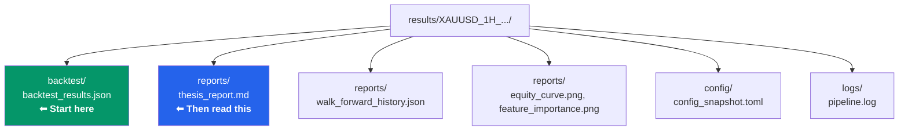
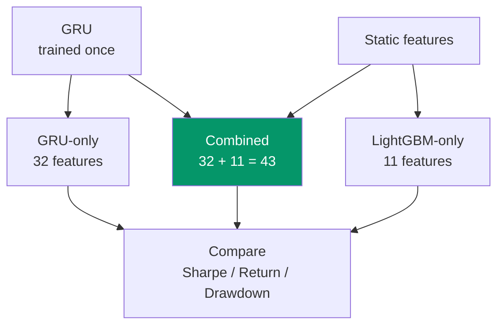

# Evaluation Guide

> A beginner-friendly guide on how to read and understand your results.

---

## Where to Find Results

After running `pixi run workflow`, everything is saved to a timestamped folder:

```text
results/XAUUSD_1H_20260414_042000/
```



The most important files are:

| File | What to Look At |
|------|----------------|
| `backtest/backtest_results.json` | All the numbers (metrics + trade list) |
| `reports/thesis_report.md` | Written summary with charts |
| `reports/walk_forward_history.json` | Walk-forward window boundaries and OOF row counts |

---

## The Metrics — Explained Simply

Here is every metric the backtest calculates, explained in plain language.

### Trading Activity

| Metric | What It Means |
|--------|--------------|
| **num_trades** | How many trades the model took in the test period. More trades = more data to evaluate, but also more costs. |
| **exposure_time_pct** | What percentage of the time the strategy was in a position. |
| **avg_trade_duration** | How long the average trade lasts (hours). |

> **A healthy model** has a reasonable number of trades (not too few, not too many). If your model trades only 5 times in 2 years, that is too few to be statistically meaningful.

---

### Win Rate

| Metric | What It Means |
|--------|--------------|
| **win_rate** | What percentage of all trades were profitable. |
| **long_win_rate** | Win rate for "buy" trades only. |
| **short_win_rate** | Win rate for "sell" trades only. |

> **How to read it:** If `win_rate = 0.55`, it means 55% of trades made money.
>
> **Important:** A high win rate alone does not mean the model is good. If wins are tiny and losses are huge, the model still loses money. Always look at win rate together with **profit factor** and **total return**.

---

### Money Metrics

| Metric | What It Means | Good Range |
|--------|--------------|------------|
| **return_pct** | Total percentage return on the starting capital. | Above 5% per test period |
| **profit_factor** | How much money you made vs. how much you lost. | Above 1.5 is decent, above 2.0 is good |
| **equity_final** | Final account balance. | Above initial_capital |
| **commissions** | Total commission paid across all trades. | Should not exceed total PnL |
| **expectancy_pct** | Average return you expect per trade. | Positive = good |

#### Profit Factor — The Most Important Metric

```text
Profit Factor = Total Wins ($) / Total Losses ($)
```

| Value | Meaning |
|-------|---------|
| Below 1.0 | **Losing money.** The model is worse than random. |
| 1.0 - 1.5 | **Break-even zone.** Barely profitable after costs. |
| 1.5 - 2.0 | **Decent.** The model has a real edge. |
| Above 2.0 | **Good.** Strong edge, robust performance. |
| Above 3.0 | **Suspicious.** Probably overfitted — be careful. |

> **Why is 3.0 suspicious?** In real markets, it is very hard to maintain a 3:1 win-to-loss ratio consistently. If you see this, check if your backtest has a bug or if the model memorized the training data.

---

### Risk Metrics

| Metric | What It Means | Good Range |
|--------|--------------|------------|
| **max_drawdown_pct** | The worst peak-to-trough drop in your account. | Below 20% is comfortable |
| **sharpe_ratio** | Risk-adjusted return. Higher = better returns per unit of risk. | Above 1.0 is decent, above 2.0 is very good |
| **sortino_ratio** | Like Sharpe, but only counts **downside** risk. | Above 1.5 is good |
| **calmar_ratio** | Return divided by max drawdown. | Above 1.0 is reasonable |
| **sqn** | System Quality Number. Measures trade distribution quality. | Above 1.5 is good |
| **kelly_criterion** | Optimal fraction of capital to risk per trade. | Positive = edge exists |

#### Sharpe Ratio — The Gold Standard

```text
Sharpe Ratio = (Average Return - Risk-Free Rate) / Standard Deviation of Returns
```

The Sharpe ratio measures **how much return you get per unit of risk you take**. It's the most widely used risk-adjusted performance metric.

**Components explained:**
- **Average Return**: Your strategy's mean return (daily, monthly, or annual depending on the period)
- **Risk-Free Rate**: The return you'd get from a "safe" investment like US Treasury bonds (typically ~4-5% annually currently). This is what you could earn with zero risk.
- **Standard Deviation of Returns**: How much your returns vary — a measure of volatility. High std dev means your returns swing wildly up and down.

**Why it matters:** A strategy that returns 20% with wild swings has a worse Sharpe than one that returns 15% consistently. You're compensated for risk, but the Sharpe tells you if the return justifies the ride.

| Value | Meaning |
|-------|---------|
| Below 0 | **Bad.** You'd have been better in T-bills. |
| 0 - 0.5 | **Mediocre.** The risk probably isn't worth the return. |
| 0.5 - 1.0 | **Okay.** Decent compensation for risk taken. |
| 1.0 - 2.0 | **Good.** Solid risk-adjusted performance. |
| Above 2.0 | **Excellent.** Rare in trading — be suspicious if above 3.0. |

> **Chill tip:** Think of Sharpe as "how smooth is your equity curve?" A Sharpe of 2.0 means your equity goes up in a relatively straight line. A Sharpe of 0.5 means your equity is a rollercoaster — even if the end result is profit.

---

#### Sortino Ratio — Sharpe's Smarter Brother

```text
Sortino Ratio = (Average Return - Target Return) / Downside Deviation
```

The Sortino ratio improves on Sharpe by **only penalizing downside volatility** — the bad volatility that hurts you. Upside volatility (gains) should be celebrated, not punished.

**Why it matters:** A strategy that has occasional blowout gains but steady smaller losses will have high standard deviation (Sharpe penalizes this) but controlled downside deviations (Sortino rewards this). Sortino gives you credit for "good chaos."

| Value | Meaning |
|-------|---------|
| Below 0.5 | **Poor.** Significant downside risk relative to returns. |
| 0.5 - 1.5 | **Acceptable.** Reasonable downside control. |
| 1.5 - 2.5 | **Good.** Strong downside protection. |
| Above 2.5 | **Excellent.** Very rare in live trading. |

> **Tip:** For trading strategies, **Sortino > Sharpe** because we only care about limiting losses, not limiting wins.

---

#### Calmar Ratio — Return Per Unit of Worst-Case Loss

```text
Calmar Ratio = Total Return / Max Drawdown
```

Calmar stands for **California Managed Account Report** — it was created to evaluate commodity trading advisors (CTAs). It measures how much return you generate relative to your worst historical drawdown.

**Why it matters:** Max drawdown is the most psychologically painful part of trading. A strategy with 50% returns but a 40% drawdown has Calmar = 1.25. Another with 20% returns and 5% drawdown has Calmar = 4.0 — the second is often preferred despite lower absolute returns.

| Value | Meaning |
|-------|---------|
| Below 0.5 | **Risky.** Large drawdowns relative to returns. |
| 0.5 - 1.0 | **Acceptable.** Reasonable risk-return trade-off. |
| 1.0 - 2.0 | **Good.** Strong returns relative to worst-case loss. |
| Above 2.0 | **Excellent.** Only achievable with very controlled drawdowns. |

> **Important:** Calmar is calculated on **past maximum drawdown** — it's not forward-looking. A strategy with Calmar = 3.0 in backtest might hit a 50% drawdown next year.

---

#### System Quality Number (SQN) — Van Tharp's Measure

```text
SQN = (Annual Return / Annual Volatility) × √(Trades Per Year / Total Trades in Test)
```

Van Tharp's SQN normalizes returns by volatility and adjusts for the statistical significance of your trade count.

**Why it matters:** A 100-trade system with SQN = 2.0 is more reliable than a 20-trade system with the same SQN. More trades = more statistical confidence.

| SQN Value | Rating | What It Means |
|-----------|--------|---------------|
| Below 1.0 | **Poor** | High risk, low reward system |
| 1.0 - 1.9 | **Average** | Marginal system — needs improvement |
| 2.0 - 2.9 | **Good** | Solid system with statistical significance |
| 3.0 - 4.9 | **Excellent** | Rare, highly robust system |
| 5.0+ | **Superb** | Usually only from systematic edge strategies |

> **Real-world reference:** Most professional traders target SQN ≥ 2.0. The thinkorswim platform by TD Ameritrade considers SQN above 2.0 as a "good system."

---

#### Kelly Criterion — How Much to Bet?

```text
Kelly % = Win Rate - (Loss Rate / Profit Ratio)

Where:
  Win Rate = % of winning trades
  Loss Rate = % of losing trades (= 1 - Win Rate)
  Profit Ratio = Average Win / Average Loss
```

The Kelly criterion tells you the **mathematically optimal fraction of your capital to risk per trade** — assuming you can trade infinitely with no market impact.

**Example calculation:**
```
Win Rate = 55% = 0.55
Loss Rate = 45% = 0.45
Average Win = $100
Average Loss = $80
Profit Ratio = 100/80 = 1.25

Kelly % = 0.55 - (0.45 / 1.25) = 0.55 - 0.36 = 0.19 = 19%
```

| Kelly Value | Recommendation |
|------------|---------------|
| Negative | **No edge** — don't trade this system |
| 0 - 15% | Conservative — small position sizes |
| 15 - 25% | Moderate — standard sizing (optimal range) |
| 25 - 40% | Aggressive — for large accounts only |
| Above 40% | **Very Aggressive** — high risk, requires perfect execution |

> **Safety rule:** In practice, never use more than **Half-Kelly** (divide Kelly by 2) or **Third-Kelly** (divide by 3). At Kelly = 20%, use 7-10% max risk per trade. This reduces volatility while keeping most of the geometric growth advantage.

---

#### Max Drawdown — How Much Pain?

```text
Max Drawdown = Biggest drop from your highest account value
```

Max drawdown is the **largest peak-to-trough decline** in your equity curve. It tells you the worst-case scenario you've experienced historically.

**How it's calculated:**
```
Peak = $120,000 (highest equity ever)
Trough = $96,000 (lowest point after that peak)
Max Drawdown = ($120,000 - $96,000) / $120,000 = 20%
```

**Why it matters:** Max drawdown is what you actually experience emotionally. Even if your strategy averages 30% annual returns, a single 50% drawdown can:
- Trigger margin calls
- Cause you to abandon the strategy at the worst time
- Lead to account blow-up if leverage is used

| Value | What It Means |
|-------|--------------|
| < 10% | **Excellent.** Very controlled risk. |
| 10 - 20% | **Good.** Normal for a trend-following strategy. |
| 20 - 30% | **Acceptable.** Common in volatile markets. |
| 30 - 50% | **High risk.** May cause emotional decision-making. |
| > 50% | **Dangerous.** Requires significant capital to survive. |

> **Real-talk:** If your max drawdown is 40%, that means at some point you lost almost half your money. Ask yourself: would you emotionally survive that? Most people can't. Professional traders often set **maximum tolerable drawdown** as a stop-loss for the strategy itself — if exceeded, they stop trading until the strategy is re-evaluated.

---

#### Recovery Factor — How Fast You Bounce Back

```text
Recovery Factor = Net Profit / Max Drawdown
```

Recovery factor measures how efficiently your strategy **recovers from its worst drawdown**. It's a measure of resilience.

**Example:**
```
Net Profit = $30,000
Max Drawdown = $10,000
Recovery Factor = 30,000 / 10,000 = 3.0
```

| Value | Meaning |
|-------|---------|
| < 1.0 | **Bad.** Strategy never recovered its worst loss. |
| 1.0 - 2.0 | **Marginal.** Slow recovery, uncomfortable. |
| 2.0 - 4.0 | **Good.** Reasonable recovery period. |
| > 4.0 | **Excellent.** Quick recovery from worst case. |

> **Note:** A strategy with high returns but also high drawdown can have the same recovery factor as a moderate strategy with low drawdown. Always look at both the return and the drawdown that produced it.

---

### Other Metrics

| Metric | What It Means | How to Use It |
|--------|--------------|---------------|
| **buy_&_hold_return_pct** | How much you'd make just buying and holding gold from the start to end of the test period. | This is your **benchmark**. If your strategy returns less than this, you could have just held and done better. |
| **alpha_pct** | Your strategy's excess return over buy & hold. Calculated as: `strategy_return - buy_hold_return`. | **Positive alpha means the model adds value** beyond passive holding. Aim for alpha > 0. |
| **beta** | Measures how much your strategy moves with buy & hold. 1.0 = identical moves, 0.0 = independent, -1.0 = opposite moves. | **Lower beta** (0.3–0.7) means your strategy is **less dependent on market direction**. Good for diversification. |
| **volatility_ann_pct** | Annualized standard deviation of your returns. Measures how much your equity swings. | **Lower is smoother**. Compare to buy & hold volatility. If your volatility is much higher than buy & hold, you're taking more risk for similar returns. |
| **cagr_pct** | Compound Annual Growth Rate — the steady yearly growth rate that gets you from start to end balance. | **Higher is better**, but compare with volatility to see if the returns justify the risk. A high CAGR with extremely high volatility is not as impressive as moderate CAGR with low volatility. |
| **recovery_factor** | Total net profit divided by max drawdown. Measures how quickly you recover from your worst loss. | **Above 2.0 is good.** A recovery factor of 3.0 means you recovered 3x your worst drawdown. Below 1.0 means you never fully recovered. |
| **sqn** (System Quality Number) | A metric from Van Tharp's methodology. Measures the quality of your system based on trade distribution. | **Above 1.5 is acceptable, above 2.0 is good, above 2.5 is excellent.** SQN = (annual_return / annual_volatility) × sqrt(num_trades_per_year / num_trades_in_test). |
| **kelly_criterion** | The optimal fraction of your capital to risk on each trade, assuming you can trade infinitely. | **Positive = edge exists.** Displayed as percentage in dashboard (e.g., 55.8%). Typically divide by 2–3 for real-world safety. Never risk more than 2% per trade in practice. |
| **avg_trade_duration** | Average time a trade is open before being closed (by TP, SL, or horizon). | Compare to your horizon_bars setting. If avg duration is much shorter than horizon, TP/SL are being hit first. |
| **exposure_time_pct** | Percentage of time you were in a position (not flat/cash). | **40–70% is normal** for a moderate strategy. Above 80% means you're almost always in a trade (high market commitment). Below 20% means you're very selective. |
| **trade_count_per_day** | Average number of trades per calendar day. | Helps you estimate broker commissions and account for slippage in live trading. Higher frequency = more costs. |

---

## Walk-Forward Out-of-Fold (OOF) Predictions

The pipeline uses **walk-forward validation** to avoid look-ahead bias. Understanding how OOF predictions work is key to trusting the backtest results.

### What Are OOF Predictions?

In each walk-forward window, the model is trained on past data and predicts on a **test slice it has never seen**. These test-slice predictions are called **out-of-fold (OOF)** predictions because the model was not trained on that data.

### How It Works

```text
Window 1:  [Train] → [Test Slice 1] → OOF predictions
Window 2:  [Train + Slice 1] → [Test Slice 2] → OOF predictions
Window 3:  [Train + Slices 1-2] → [Test Slice 3] → OOF predictions
                           ⋮
All OOF predictions concatenated → unbiased evaluation
```

### Why It Matters

- **No data leakage:** Each prediction is made on data the model never trained on.
- **Realistic evaluation:** The backtest runs on these OOF predictions, so the trading results reflect genuine out-of-sample performance.
- **Window boundaries:** `reports/walk_forward_history.json` records the exact date ranges and row counts for each window, so you can verify coverage.

### Where to Check

| File | What It Contains |
|------|-----------------|
| `reports/walk_forward_history.json` | Window boundaries, OOF row counts per window |
| `predictions/final_predictions.csv` | Full prediction set including OOF signal column |

> **Tip:** If the total OOF rows are much fewer than your test period length, the walk-forward windows may not cover the full test range. Check the window dates in `walk_forward_history.json` against your configured `test_start` and `test_end`.

---

## Interactive Dashboard - Performance Overview

The project includes an **interactive Streamlit dashboard** that provides real-time metric evaluation with color-coded zones and recommendations.

### Launch the Dashboard

```bash
pixi run streamlit    # Opens at http://localhost:8501
```

### Performance Overview Features

The dashboard displays metrics in organized rows with intelligent zone evaluation:

#### 🎯 Enhanced Metric Zones
- **Real-time evaluation**: Each metric gets color-coded zones (red/yellow/green)
- **Actionable recommendations**: Every zone includes specific guidance
- **XAUUSD-optimized**: All thresholds calibrated for gold trading characteristics

#### ⚠️ Extreme Value Detection
- **Automatic filtering**: Values exceeding realistic thresholds get flagged
- **Visual indicators**: "⚠️" warning symbol appears next to extreme values
- **Contextual warnings**: Explains potential overfitting or data issues
- **Example**: Recovery Factor of 100.89 shows as "100.89 ⚠️" with red "Extreme" badge

#### 📊 Enhanced Metrics
- **Avg Win/Loss**: Dollar-based zones ($50-$200-$500) for trade profitability
- **Kelly Criterion**: Displayed as percentage (e.g., 55.8% instead of 0.558)
- **Best/Worst Trade**: Percentage-based zones for single-trade performance
- **Equity Metrics**: Contextual evaluation relative to configured initial capital

#### 🎨 Visual Features
- **Equal-width cards**: Clean, organized layout across all rows
- **Color-coded zones**: Green (excellent), Lime (good), Yellow (moderate), Orange (poor), Red (dangerous)
- **Hover details**: Additional context and recommendations for each metric

### How to Use the Dashboard

1. **Select Session**: Choose a backtest session from the dropdown
2. **Review Performance Overview**: Check metric zones and warnings
3. **Investigate Extremes**: Look for "⚠️" symbols indicating potential issues
4. **Compare Zones**: Green zones indicate good performance, red zones need attention
5. **Read Recommendations**: Each zone provides specific improvement guidance

### Metric Interpretation Guide

| Zone Color | Meaning | Action Required |
|------------|---------|-----------------|
| 🟢 Green | Excellent | Maintain current approach |
| 🟡 Lime | Good | Solid performance, minor tweaks possible |
| 🟠 Yellow | Moderate | Acceptable but room for improvement |
| 🟠 Orange | Poor | Review strategy, consider adjustments |
| 🔴 Red | Dangerous | Immediate attention required |

---

## Reading the Charts

The pipeline generates **static charts** in `reports/` and an **interactive Bokeh chart** in `backtest/`. Interactive pyecharts visualizations are also available through the Streamlit dashboard (see the Dashboard section above).

### Static Charts (`reports/`)

| File | What to Look For |
|------|-----------------|
| `equity_curve.png` | Equity curve over time. Should trend upward with manageable drawdowns. |
| `feature_importance.png` | Top-20 features by importance. Check if GRU features dominate or if static features contribute. |
| `shap_summary.png` | SHAP value breakdown by class (Long/Hold/Short). Shows which features push predictions toward each class. |

### Interactive Backtest Chart (`backtest/`)

| File | What to Look For |
|------|-----------------|
| `backtest_chart.html` | Interactive Bokeh chart with equity curve, drawdown overlay, and trade markers. Resampled for performance. Open in any browser. |

### Dashboard Charts (Streamlit)

The `pixi run streamlit` dashboard provides additional interactive charts powered by pyecharts:

- **Candlestick chart** — OHLC with volume, trade markers, and predictions overlay
- **Label distribution** — Pie chart showing class balance (Long/Flat/Short)
- **Feature correlation heatmap** — Identifies redundant features
- **Feature distributions** — Per-feature histogram across the dataset
- **Confusion matrix** — Model accuracy breakdown by class
- **Confidence distribution** — Prediction confidence for correct vs. incorrect predictions
- **Feature importance & SHAP** — Interactive bar charts for feature analysis
- **Equity & drawdown** — Interactive equity curve with drawdown overlay
- **PnL histogram** — Distribution of trade profits and losses
- **Monthly returns heatmap** — Calendar heatmap of monthly returns
- **Rolling Sharpe** — Rolling Sharpe ratio over a 30-trade window
- **Duration vs. PnL scatter** — Trade duration vs. profit relationship

### Backtest Data Files (`backtest/`)

| File | What It Contains |
|------|------------------|
| `backtest_results.json` | All metrics + full trade list (JSON) |
| `trades_detail.csv` | Per-trade breakdown: entry/exit time, direction, PnL, commission, duration |
| `equity_curve.csv` | Running equity and drawdown percentage per trade |

---

## Reading the Confusion Matrix

The confusion matrix shows you **where the model makes mistakes**.

```text
              Predicted
              Long   Flat   Short
Actual Long  [0.45] [0.30] [0.25]
Actual Flat  [0.15] [0.60] [0.25]
Actual Short [0.10] [0.20] [0.70]
```

- **Diagonal (top-left to bottom-right):** Correct predictions. Higher = better.
- **Off-diagonal:** Mistakes. The model confused one class for another.

> **What to check:**
> - Is the model confusing Long with Short? That is dangerous — it means the model buys when it should sell.
> - Is the "Flat" row high? That means the model is predicting Flat correctly but missing trading opportunities.
> - The model does not need to be perfect. Even 40% accuracy on a 3-class problem can be profitable if the winning trades are big enough.

---

## Ablation Study — Proving the Hybrid Works

> **Note:** Ablation is not a built-in pipeline stage. There is no `--ablation` flag or `pixi run ablation` task. The section below describes a manual comparison approach you can run by training variants separately and comparing their backtest results.

The ablation study compares three variants:



| Variant | What It Uses | What to Expect |
|---------|-------------|----------------|
| **LightGBM only** | 11 static features | Decent baseline, misses time patterns |
| **GRU only** | 32 hidden states | Captures patterns but loses indicator info |
| **Combined** | 32 GRU + 11 static | Should be the best of both worlds |

### How to Read the Comparison

Look at `ablation_results.json` (hypothetical example — you would generate this manually):

```json
{
  "lgbm_only": {
    "metrics": { "sharpe_ratio": 0.8, "return_pct": 5.2, "num_trades": 320 },
    "feature_count": 11
  },
  "gru_only": {
    "metrics": { "sharpe_ratio": 0.6, "return_pct": 3.1, "num_trades": 280 },
    "feature_count": 32
  },
  "combined": {
    "metrics": { "sharpe_ratio": 1.2, "return_pct": 8.7, "num_trades": 410 },
    "feature_count": 43
  },
  "comparison_note": "Best variant: combined."
}
```

> **If Combined wins:** The hybrid approach is justified — GRU and LightGBM complement each other.
>
> **If LightGBM only wins:** The GRU might be adding noise. Try adjusting GRU parameters or sequence length.
>
> **If GRU only wins:** The static features might be redundant. Check feature correlation and importance.

---

## Red Flags — When to Worry

| Red Flag | What It Probably Means |
|----------|----------------------|
| Sharpe ratio above 3.0 | Overfitting — the model memorized the data |
| Only 10-20 trades | Not enough data to draw conclusions |
| Win rate above 80% | Very likely overfitting |
| Max drawdown above 40% | Risk management is failing |
| Huge gap between train and test performance | Data leakage or overfitting |
| All predictions are "Flat" | Model is too conservative — check class balance in training data |
| Backtest return is negative but model accuracy is high | Costs (spread, commission) are eating all the profit |
| 0 trades in backtest | Position size too large for available margin — reduce lots_per_trade or increase leverage |
| Profit factor above 3.0 | Suspicious — hard to maintain in real markets |
| Alpha negative (model loses vs buy & hold) | Model adds no value over passive holding |
| Recovery factor below 1.0 | Never recovered from worst drawdown |
| Trades per day < 0.1 | Model is too selective — may miss opportunities |
| SQN below 1.0 | Poor system quality according to Van Tharp's standards |
| Beta > 1.2 | Strategy amplifies market moves — high market correlation |
| Exposure time < 10% | Model barely participates in the market |

---

## Green Flags — When to Be Happy

| Green Flag | What It Means |
|-----------|--------------|
| Sharpe between 1.0 and 2.0 | Solid risk-adjusted returns |
| 200+ trades | Statistically meaningful sample |
| Max drawdown under 15% | Good risk control |
| Profit factor above 1.5 | Real, consistent edge |
| Monthly returns mostly green | Strategy works across market conditions |
| Ablation shows Combined > individual | Hybrid approach is validated |
| Sortino ratio > 1.5 | Good downside risk control |
| Alpha positive | Model adds value over passive holding |
| Beta < 0.8 | Strategy moves independently from market |
| Recovery factor > 2.0 | Good at recovering from drawdowns |
| Exposure time 30–70% | Selective trading, not overtrading |

---

## Metric Recommendation Zones

Use this table to understand if your metrics are in a healthy range. These are **XAU/USD 1H-optimized targets** based on real-world benchmarks from professional gold trading strategies.

> **XAU/USD Specifics:** Gold is more volatile than forex pairs, trades almost 24/5, and has distinct regimes (trending vs ranging). This affects what "good" looks like. Real-world professional XAUUSD strategies achieve: Sharpe 0.5–2.0, Profit Factor 1.5–2.0, Win Rate 35–55%.

### Core Performance Metrics

| Metric | ⚠️ Warning Zone | ✅ Acceptable | 🎯 Target Zone | 🚀 Excellent |
|--------|----------------|-------------|--------------|------------|
| **Sharpe Ratio** | < 0.5 | 0.5 – 1.0 | 1.0 – 2.0 | > 2.0 (verify if > 3.0) |
| **Sortino Ratio** | < 0.5 | 0.5 – 1.5 | 1.5 – 2.5 | > 2.5 (verify if > 4.0) |
| **Profit Factor** | < 1.2 | 1.2 – 1.5 | 1.5 – 2.0 | > 2.0 (⚠️ >3.0 suspicious for XAUUSD) |
| **Win Rate** | < 35% | 35 – 45% | 45 – 55% | > 55% (⚠️ >65% suspicious for trend-following) |
| **Return %** | < 0% | 0 – 50% | 50 – 200% | 200 – 500% (⚠️ >500% verify) |

### Risk Management Metrics

| Metric | ⚠️ Warning Zone | ✅ Acceptable | 🎯 Target Zone | 🚀 Excellent |
|--------|----------------|-------------|--------------|------------|
| **Max Drawdown %** | > 35% | 20 – 35% | 10 – 20% | < 10% |
| **Calmar Ratio** | < 0.5 | 0.5 – 1.0 | 1.0 – 2.0 | > 2.0 |
| **Recovery Factor** | < 1.0 | 1.0 – 2.0 | 2.0 – 4.0 | > 4.0 |
| **Kelly Criterion** | Negative | 0 – 0.15 | 0.15 – 0.25 | 0.25 – 0.40 (⚠️ >0.40 dangerous) |

### Trading Activity Metrics

| Metric | ⚠️ Warning Zone | ✅ Acceptable | 🎯 Target Zone | 🚀 Excellent |
|--------|----------------|-------------|--------------|------------|
| **Number of Trades** | < 100 | 100 – 200 | 200 – 500 | > 500 |
| **Exposure Time %** | < 15% or > 80% | 15 – 30% or 70 – 80% | 30 – 60% | 40 – 55% |
| **Avg Trade Duration** | < 2h or > 4 days | 2 – 6h or 2 – 4 days | 6h – 2 days | 8h – 1.5 days |
| **Trades per Day** | < 0.3 | 0.3 – 0.7 | 0.7 – 1.2 | > 1.2 |

### Benchmark Comparison Metrics

| Metric | ⚠️ Warning Zone | ✅ Acceptable | 🎯 Target Zone | 🚀 Excellent |
|--------|----------------|-------------|--------------|------------|
| **Alpha %** | < 0% | 0 – 5% | 5 – 15% | > 15% |
| **Beta** | > 1.3 or < -0.2 | 0.7 – 1.3 | 0.3 – 0.7 | < 0.3 |
| **Volatility (Ann) %** | > 35% | 20 – 35% | 10 – 20% | < 10% |
| **CAGR %** | < 5% | 5 – 15% | 15 – 30% | 30 – 50% (⚠️ >50% verify) |
| **vs Buy & Hold Vol** | > 1.5x | 1.0 – 1.5x | 0.6 – 1.0x | < 0.6x |

> **How to read this table**: If your metric is in the "Warning Zone", investigate what went wrong. "Acceptable" means the model works but has room for improvement. "Target" is where you want to be. "Excellent" is great but be suspicious if everything is in "Excellent" — it could mean overfitting.

### Real-World XAUUSD Benchmarks

For reference, here are published results from real XAUUSD trading strategies:

| Strategy | Sharpe | PF | Win Rate | Max DD | Return | Source |
|---------|--------|-----|---------|--------|--------|--------|
| Pullback Window (5yr) | 0.89 | 1.64 | 55.43% | 5.81% | +44.75% | GitHub backtest |
| M-Max EA Gold | 2.29 | - | - | - | - | YoForex |
| SMC Flow (institutional) | 10.35 | 2.03 | - | 7.5% | +105% | MQL5 |

> **Note:** Sharpe > 3.0 on a single backtest should be treated with skepticism — XAUUSD's volatility makes extremely high Sharpe ratios unlikely to persist in live trading without overfitting.

---

## Quick Sanity Checklist

Run through this list after every experiment:

- [ ] Did the pipeline complete without errors?
- [ ] Is the test period long enough (at least 6 months, ideally 1+ year)?
- [ ] Are there enough trades (at least 100, preferably 200+)?
- [ ] Is the Sharpe ratio between 0.5 and 3.0?
- [ ] Is the max drawdown below 35% (XAUUSD is volatile)?
- [ ] Is the profit factor above 1.2 (1.5+ is better)?
- [ ] Does the equity curve go up over time?
- [ ] Does the ablation study confirm the hybrid is better?
- [ ] Is the win rate between 35–65% (outside this range = investigate)?
- [ ] Is profit factor below 3.0 (above = suspicious for XAUUSD)?

If you can check all these boxes — nice work! You have a reasonable model for XAUUSD.
